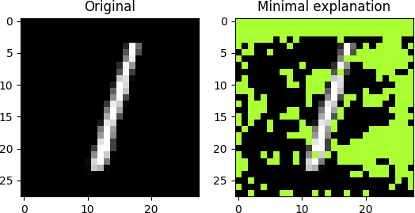
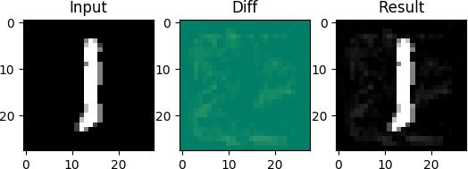
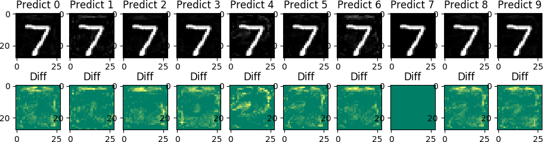
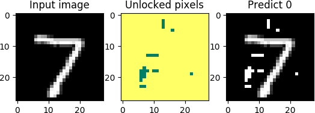
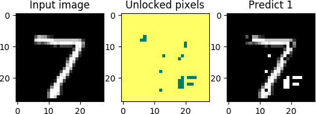

# explain
Experiments in explainable AI with exact optimization tools on the MNIST image dataset. 

Dependencies: 
- python3
- CPLEX (and docplex python library)
- matplotlib
- numpy
- keras 

## [twoclass](./twoclass)
Proof-of-concept level scripts on a simple neural network and a binary classification task.

`train_twoclass.py`

Train a simple fully connected neural network with one hidden layer.

`min_explanation.py`

Compute an "explanation" of a prediciton. Given an input image this is a minimal set of pixels which determine the output label, regardless the value of any other pixels. 
Uses CPLEX as a decision procedure for a "destructive MUS" algorithm.

`min_adv_sum.py`

Compute the smallest adversarial example with respect to sum of squared errors
on the original picture, using mixed integer quadratic programming (MIQP).

`min_adv_card.py` 

Compute a smallest adversarial example with respect the total number of changed 
pixels from the original input using mixed integer programming (MIP).

## [multiclass](./multiclass)

Apply the above techniques to a multiclass classifier.

`train_multiclass.py`

Train a somewhat more complicated neural network 
with multiple hidden layers and output classes.

`min_adv_sum.py`

For a given imput image, compute the minimal changes 
to predict each possible label.

## [cnn](./cnn)

Can we do the same with simple convolutional networks?

`train_cnn_simple.py`

Train a simple CNN with 10 3x3 convolution kernels.

`min_adv_sum.py`

As above, but we observe clear visual differences in the minimum adversarial changes compared to the network without convolution.

`min_adv_card.py`

Computing minimum number of changed pixels instead.

## [binary](./binary)

`binary.py`

Implement some encodings of AAAI paper [Verifying Properties of Binarized Deep Neural Networks](https://www.aaai.org/ocs/index.php/AAAI/AAAI18/paper/view/16898/16241)
- MIP: working
- IP:  working
- CNF: producing intractably large formulas